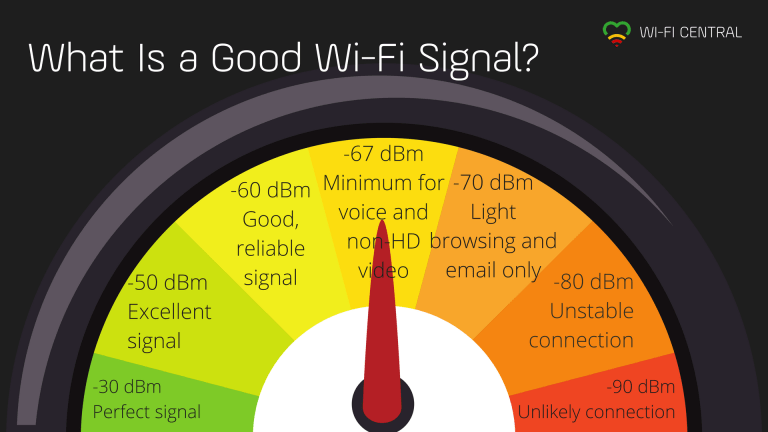

<p align="center">
 
</p>

<h1 align="center">Wifi Signal Strength Meter</h1>

<div align="center">

[](https://opensource.org/licenses/MIT)

<h4>This application can be used to measure the strength of WiFi signals that your device is receiving. Move around as you do this, and the app keeps track of signal variations as you move, second by second. Find the best spot, and forget buffering and lagging video calls! </h4>

</div>

-----------------------------------------
### Inspiration

* Internet has become an essential part of our life, these days, everyone want faster internet. WiFi technology uses radio waves to provide internet connectivity. It’s one of the most ubiquitous and standardized access point in the world of technology.  

* Wi-Fi signal strength depends on a variety of factors, such as how far you are from the router, whether it’s a 2.4 or 5ghz connection, and even the materials of the walls around you. The closer you are to the router, the better.

* This application can be used to measure the strength of WiFi signals that your device is receiving. A stronger Wi-Fi signal means a more reliable connection. This is what enables you to take full advantage of the internet speeds available to you. 

------------------------------------------
### Features

- `Detect nearby WiFi networks` : Get a list of nearby WiFi networks. WiFi will be turned on automatically when you open the app. Turn on Location on your device and press 'SCAN'.
- `Get details of the connected WiFI network` : Connect to a WiFi network and press 'GET INFO' to get the details of the network such as Network id, SSID, BSSID, Link Speed, Frequency, and IP address.
- `Measure signal strength` : The app displays the signal strength of the network to which the device is connected every second for a period of 1 minute or until you press 'STOP'. The average signal strength at the end of 1 minute is also displayed. The signal measurement is not converted to %, and you get raw data in <strong>dBm</strong>. dBm is typically expressed as a negative number. The closer to zero the reading is, the stronger the signal. So for example, -79 dBm is a stronger signal than -88 dBm.
- `Save the results` : Store the details of the network and the entire signal strength log in a txt file for future reference.
- `Load a saved file` : Load a previously saved log file from within the app itself.


<p align="center">
 
</p>

------------------------------------------
### Demo
<p align="center">
    
</p>


------------------------------------------
### Installation
* For Usage
    * Download the [`Wifi_Signal_Strength_Meter.apk`](./Wifi_Signal_Strength_Meter.apk) and install it on your device. 
    * Grant 'Storage' and 'Location' permission to the app.
  
* For Development
    * Clone the repo
    ```sh
        $ git clone https://github.com/mihir-m-gandhi/WiFi-Signal-Strength-Meter
    ```
    * Open `Code` folder in Android Studio.
    
------------------------------------------
### Author
Mihir Gandhi - [mihir-m-gandhi](https://github.com/mihir-m-gandhi)

------------------------------------------
### License
This project is licensed under the MIT - see the [LICENSE](./LICENSE) file for details.
